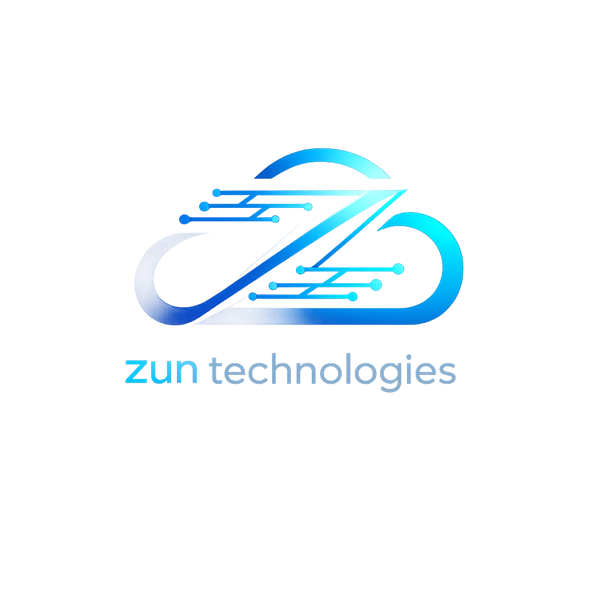
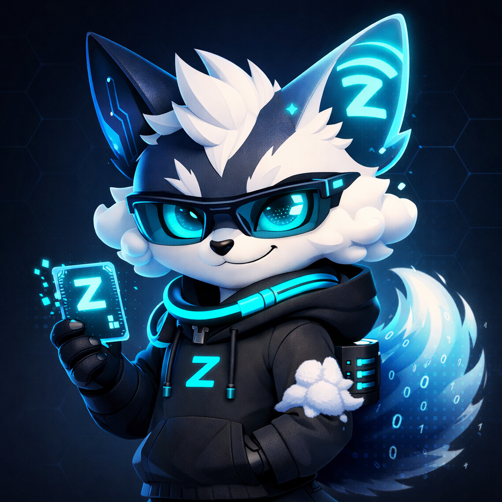

  
  
  # ⚡ Zun Technologies – Bộ nhận diện thương hiệu
  
  *Logo chính thức & Linh vật đại diện*
  
  
  
  

---

## 📌 Giới thiệu chung

**Zun Technologies** là công ty công nghệ chuyên về giải pháp cloud, mã nguồn mở và các sản phẩm số hướng đến cộng đồng.  
Bộ nhận diện thương hiệu của chúng tôi gồm hai thành phần chính:

1. **Logo công ty** – thể hiện sự chuyên nghiệp, tin cậy và tầm nhìn công nghệ.  
2. **Linh vật Zunny** – đại diện cho sự sáng tạo, kết nối và tinh thần cộng đồng.

Hai hình ảnh này được sử dụng linh hoạt tùy theo ngữ cảnh, nhưng luôn đảm bảo tính nhất quán về màu sắc, phong cách và thông điệp.

---

## 🏢 1. Logo công ty – Zun Technologies

  

### 🔹 Thiết kế & ý nghĩa

| Yếu tố | Mô tả |
|--------|-------|
| **Hình khối chính** | Chữ “Z” cách điệu, kết hợp giữa góc cắt mạnh mẽ (tia sét) và đường cong mềm mại (đám mây), tượng trưng cho sự kết hợp giữa hiệu suất cao và tính linh hoạt. |
| **Màu sắc** | Xanh than chủ đạo (#0A192F) – thể hiện sự vững chắc, uy tín. Điểm nhấn xanh cyan điện (#00C8FF) – đại diện cho công nghệ, kết nối và tốc độ. |
| **Font chữ** | Sans-serif hiện đại, tối giản, dễ đọc trên mọi nền tảng. |
| **Bố cục** | Dạng biểu tượng (icon) kèm chữ hoặc chỉ riêng icon – tối ưu cho các không gian nhỏ như favicon, avatar GitHub. |

### 🔹 Ứng dụng

- **Website chính thức:** Sử dụng phiên bản đầy đủ (icon + chữ) trên header.  
- **GitHub Organization:** Avatar dạng icon riêng, nền xanh than.  
- **Tài liệu, email signature:** Dùng phiên bản chữ kết hợp với icon nhỏ.  
- **Sản phẩm phần mềm:** Tích hợp logo trong splash screen, about dialog.

---

## 🦊 2. Linh vật Zunny

  

### 🔹 Câu chuyện linh vật

**Zunny** là sự kết hợp độc đáo giữa một chú **cáo công nghệ** và **đám mây số** – không phải mèo, không phải robot, mà là một thực thể riêng biệt chỉ thuộc về Zun Technologies.  

- **Đôi tai bất đối xứng:** Tai trái là sóng Wi‑fi tạo hình chữ **Z** (kết nối không giới hạn), tai phải là khối kim loại với vân mạch điện tử (công nghệ lõi).  
- **Đôi mắt cyan:** Đồng tử có hoa văn lục giác, thể hiện tầm nhìn dữ liệu và sự thông minh.  
- **Phụ kiện:** Kính AR gọng cyan, dây cáp quàng cổ phát sáng, thẻ chìa khóa hologram chữ **Z** – tất cả đều là biểu tượng của quyền truy cập, bảo mật và sự sẵn sàng mở rộng.  
- **Trang phục:** Áo hoodie đen với logo **Z** phát sáng, tay áo có họa tiết mây tan – vừa casual vừa mang hơi hướng công nghệ.  
- **Chiếc đuôi:** Mềm mại, chuyển từ xanh đặc sang trong suốt, có các số 0 và 1 lơ lửng – tượng trưng cho dữ liệu luôn vận động.

### 🔹 Ứng dụng

- **Kênh hỗ trợ cộng đồng:** Avatar Telegram bot [@Zunnycloud_bot](https://t.me/Zunnycloud_bot) sử dụng hình Zunny.  
- **Tài liệu hướng dẫn, blog:** Minh họa các bài viết bằng các trạng thái khác nhau của Zunny (đang code, deploy, bảo trì…).  
- **Sticker, icon cảm xúc:** Dùng trong các kênh chat nội bộ hoặc cộng đồng.  
- **Sự kiện, quà tặng:** In trên sticker, áo thun, vật phẩm truyền thông.

---

## 🎨 Bảng tổng quan

| Hình thức | Mục đích sử dụng chính | Phong cách |
|-----------|------------------------|------------|
| **Logo Zun Technologies** (zun.jpg) | Nhận diện công ty, website, tài liệu chính thức, GitHub org | Chuyên nghiệp, tối giản, công nghệ |
| **Linh vật Zunny** (zunnyavatar.jpg) | Tương tác cộng đồng, kênh hỗ trợ, nội dung thân thiện | Dễ thương pha ngầu, biểu cảm sống động |

Cả hai đều dùng chung bảng màu **xanh than – xanh cyan**, đảm bảo sự đồng bộ và nhận diện thương hiệu xuyên suốt.

---

## 📁 Cấu trúc thư mục

zunny/
├── zun.jpg                # Logo công ty (avatar vuông)
Nếu cần thêm các biến thể (logo ngang, sticker, ảnh nền…), chúng tôi sẽ mở rộng thư mục `variants/` và cập nhật tài liệu.

---

## 📫 Liên hệ & Đóng góp

Mọi ý kiến đóng góp về bộ nhận diện thương hiệu, hoặc báo cáo sai sót, vui lòng liên hệ:

- **Telegram Bot:** [@Zunnycloud_bot](https://t.me/Zunnycloud_bot)  
- **Email:** [zunny932@gmail.com](mailto:zunny932@gmail.com)

Zun Technologies luôn trân trọng mọi phản hồi từ cộng đồng.

---

  © 2026 Zun Technologies – Bản quyền thuộc về Zun Technologies.  
  Logo và linh vật là tài sản độc quyền, vui lòng không sử dụng khi chưa có sự cho phép.

